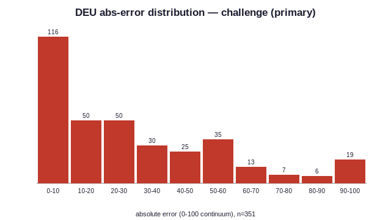
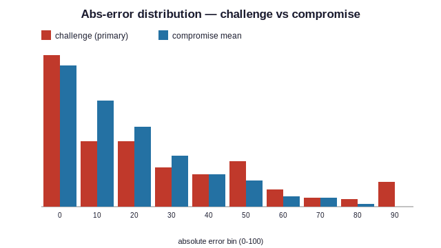
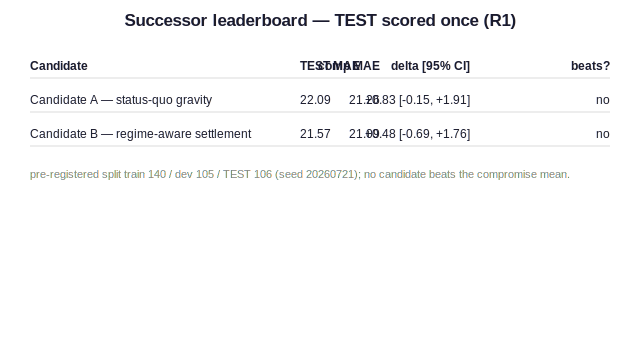
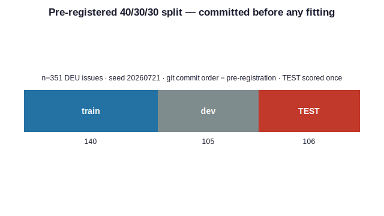

# Structure, Not Magic: An Open Replication and Predictability Ceiling for the Bueno de Mesquita Forecasting Model

**Hassan [surname]**  
Independent Researcher  
Preprint · 2026-07-24 · v1

Code, data, and one-command reproduction: https://github.com/hamzagul07/schelling

## Abstract

The expected-utility group-decision model of Bueno de Mesquita — deployed by the CIA as Policon and long credited with striking forecasting accuracy — has never had a complete open implementation or a fair public evaluation. We provide both. Our replication, built from the Scholz–Calbert–Smith reconstruction with every interpretive choice logged, reproduces the published reference case. Evaluated on 351 expert-coded EU legislative controversies with sourced actor capabilities and reference points, the model fails a pre-registered accuracy gate against a far simpler benchmark: the capability-and-salience-weighted mean of actor positions. A pre-registered successor search — its data split committed to version control before any fitting — produces two structurally-motivated candidate models; both fail on held-out data. A flexible cross-validated oracle then shows the weighted mean sits at the extractable-signal ceiling for this domain and input set. We conclude that the lineage's documented successes, including its models outperforming the very analysts who supplied their inputs, are attributable to structured elicitation rather than to solution dynamics: structure, not magic. The model's home-turf claim — superiority in coercive settings — remains open, pending an ex-ante coded case library we introduce alongside a live, cryptographically sealed forecast ledger. All results regenerate from public artifacts by a single command.

## 1. Introduction

Few models in political science carry a reputation as outsized, or as strangely unexamined, as the expected-utility group-decision model of Bruce Bueno de Mesquita. Deployed inside the Central Intelligence Agency under the name Policon during the 1980s, it is the subject of a declassified internal evaluation reporting that its forecasts were accurate in roughly ninety percent of applications — and, more strikingly, that the model outperformed the very analysts who supplied its inputs (Feder 1987). Its descendants advised governments and corporations for decades; its inventor was profiled as a "new Nostradamus." Yet across forty years of influence, no complete public implementation has existed. The model's full specification was never published. The most serious reconstruction effort — three Australian defence scientists reverse-engineering the equations from scattered fragments — succeeded in reproducing published examples while documenting ambiguities, sensitivity concerns, and convergence problems the source literature never addresses (Scholz, Calbert and Smith 2011). Its commercial successor, Senturion, is proprietary. The result is an epistemic anomaly: one of the most celebrated forecasting instruments in the discipline has never been independently testable. Unfalsifiable famous models are not merely gaps in a literature; they distort it, anchoring expectations about what formal methods can do to claims no one can check.

This paper closes that anomaly, and reports what closing it reveals. We make six contributions. First, we provide an open, deterministic implementation of the model, built strictly from the Scholz reconstruction with every interpretive choice logged, which reproduces the published reference case (9.530)[^ev-E-REPL-MEDIAN]. Second, we give the model the fair evaluation it never received: 351 expert-coded legislative controversies from the Decision-Making in the European Union datasets (Thomson et al. 2006)[^ev-E-DEU-N], with treaty-regime voting weights supplied as actor capabilities and reference points restored — and the model fails a pre-registered accuracy gate against a radically simpler benchmark, the capability-and-salience-weighted mean of actor positions (FAILED)[^ev-E-DEU-GATE]. Third, we conduct a pre-registered successor search, committing the train/development/test partition to version control before any model fitting, so the repository's own history certifies that held-out data was never consulted; two structurally motivated candidate models both fail on the untouched test split (22.09 vs 21.26, 21.57 vs 21.09)[^ev-E-R1-gravity][^ev-E-R1-regime]. Fourth, a deliberately flexible cross-validated oracle model scores worse than the weighted mean (-0.84)[^ev-E-ORACLE-GAP], indicating that the simple benchmark sits at the extractable-signal ceiling for this domain and input set: the elaborate machinery was not losing to a better model, but to the absence of further signal. Fifth, these results support a reinterpretation of the lineage's documented successes. If any sane aggregation of structured inputs approaches the ceiling, then Feder's most puzzling finding — the model beating its own input-providers — requires no special dynamics to explain. The operative technology was never the solution concept; it was the discipline of forcing qualitative expertise into positions, salience, and capability before aggregating. Structure, not magic. Sixth, we introduce the apparatus for the question this paper deliberately leaves open: whether the model's bargaining dynamics earn their keep in the coercive settings for which they were designed. We contribute a blind dual-entry protocol for building an ex-ante coded case library from the lineage's own published applications (True)[^ev-E-CHINA-VERIFIED], and a commit-reveal forecast ledger in which live predictions are cryptographically sealed before events resolve (34.576, 41.636, 29.407, 39.443)[^ev-E-LEDGER]. The coercive-domain verdict is explicitly pending; we report the infrastructure and refuse the temptation.

Two scope guards govern everything that follows, stated here rather than discovered in the limitations section. The predictability-ceiling claim is conditional: it concerns cooperative legislative bargaining as represented in DEU, using the classic input set this lineage has always used — positions, salience, capability, reference points. Richer inputs may hold further signal; coercive domains may reward mechanism. And nothing in this paper evaluates the elicitation step itself, which our reinterpretation identifies as the lineage's true engine; we take the expert-coded inputs as given. Every number cited in this paper regenerates from public artifacts by a single command, with per-claim provenance; the repository, not the prose, is the source of truth.

The remainder proceeds as follows. Section 2 presents the replication. Section 3 the fair-fight evaluation. Section 4 the successor search. Section 5 the oracle and the ceiling. Section 6 the reinterpretation. Section 7 the case-library protocol. Section 8 the commit-reveal ledger. Section 9 limitations. Section 10 concludes.

## 2. An open replication of the group-decision model

Our implementation takes as its source not the primary literature — which never contained a complete specification — but the Scholz–Calbert–Smith reconstruction, the only published attempt to assemble the model's equations in one place. We implement its pipeline in full: effective actor weights from capability and salience; pairwise positional contests and the weighted-median forecast they induce; expected utilities of challenge for every ordered dyad; risk propensities derived from each actor's security and applied as utility exponents; the classification of dyads into relational octants; the exchange of proposals and consequent position updates; and iteration to convergence. The implementation is deterministic by construction — every stochastic path takes an explicit seed, and identical inputs produce byte-identical outputs — so that the artifact itself, rather than any prose description, serves as the model's operational specification.

Reconstruction, however, is not transcription. The source literature contains genuine ambiguities, and our first methodological commitment is that every interpretive choice is logged in a public decisions file rather than silently embedded in code. Four examples convey the character of the problem. The security term that drives risk propensity is printed with contradictory superscripts in different parts of the source material; we adopt the reading in which an actor's security depends on the expected utilities *adversaries* hold for challenging it, on the theoretical ground that risk should derive from exposure. The sign condition defining the compromise octant contradicts its own accompanying figure; we follow the figure, since compromise is definitionally the both-positive quadrant. The boundaries separating several octants exist only as an unannotated diagram; we implement the natural reading — sign quadrants split by the diagonals — and flag it as inference. And the original's convergence behavior, which the reconstruction's authors themselves identify as problematic, we replace with an explicit stopping rule: iteration ends when the forecast median moves less than half a continuum unit for two consecutive rounds, or at a hard cap, with the rule that fired recorded in every output. Where an ambiguity admitted multiple readings, we adopted the one that reproduces the published replication and documented the choice — replication as specification. One such choice was reached the hard way: an initial reading of the proposal-selection rule produced a systematic downward drift in outcomes, detectable only because the replication target existed to fail against; the corrected ordering (most enforceable proposal first, least movement as tie-break) is itself a small empirical finding about what the original must have done.

The gate for all of this is the model's canonical worked example: the European emission-standards case, whose input table we transcribed twice independently and diffed before use. Our implementation converges in three rounds to a settlement median of 9.530[^ev-E-REPL-MEDIAN], within half a unit of both the reconstruction's reported steady state (9.9) and the original's stabilized prediction (9.05), with intermediate round means matching the published trajectory to within a quarter unit. Two properties of this result matter beyond the headline number. First, the coalition structure is preserved — the high-position bloc, the low cluster, and the isolated small actor remain distinct — so the median match is not an artifact of positions collapsing to a point, a failure mode that can counterfeit convergence. Second, one residual deviation exists: the reconstruction reports a first-round transient our implementation does not reproduce, which we attribute to the figure-only octant boundaries and quantify rather than conceal; the acceptance tolerance was fixed in advance and never loosened to pass. The replication test remains in the codebase as a permanent regression gate: the model cannot drift from its published behavior without a test failing.

## 3. The fair fight: evaluation on expert-coded legislative bargaining

A model that claims to forecast collective decisions should be examined on the one benchmark built for exactly that claim. The Decision-Making in the European Union datasets record real legislative controversies as this model family represents them: for each contested issue, a continuum of outcomes, expert-coded actor positions and saliences, and — decisively — the outcome actually adopted. The data were assembled independently of any one model, have anchored two decades of published comparisons, and are immune to hindsight contamination because the inputs were coded by domain experts against the controversy itself, not reconstructed after resolution. Our evaluation set comprises 351 scoreable issues[^ev-E-DEU-N]; the error metric is the absolute distance between a model's forecast and the adopted outcome on the issue's own scale; and the decision criterion was pre-registered before any result was computed: the challenge model must beat two naive baselines — the capability-and-salience-weighted mean of positions, and the position of the median actor — on mean absolute error, or the gate fails.

The first evaluation handicapped the model, and we report it because the handicap is instructive. DEU records no capability data, so all actors initially received equal capability — an assumption that amputates the model's defining input, power asymmetry, while quietly converting the rival baseline into the salience-weighted mean, the specification the literature already identifies as formidable (Achen 2006). Under these conditions the challenge model failed the gate (28.31)[^ev-E-DEU-MAE-r1], edging the median baseline but losing clearly to the weighted mean (23.64)[^ev-E-BASE-WMEAN-r1]. Two objections demanded a rematch. First, capabilities: we constructed a sourced capability table from Council voting weights under the treaty regime governing each issue, with a documented treatment of the Commission and Parliament following the dataset's own conventions, every number cited (treaty-regime Council power (pre-Nice / Nice / Lisbon), rescaled strongest=100)[^ev-E-METHOD-capabilities]. Second, the reference point: the original evaluation's configuration discarded the status quo entirely, yet DEU records a reference point on 261 issues, and the model family's own theory assigns it a role. The fair fight restored both, with the gate re-registered in advance: the fully equipped challenge model against the equally equipped weighted mean.

It failed again (FAILED)[^ev-E-DEU-GATE]. Restoring the model's genuine inputs — the power asymmetries and status-quo anchors its theory demands — did not close the gap to the simple aggregate (26.83 / 38.51 vs 22.99 / 29.77)[^ev-E-METHOD-challenge_rp][^ev-E-METHOD-baseline_wmean]. The anatomy of the failure is more informative than its size. The challenge model's errors are bimodal: its worst cases are stampedes to the extremes of the scale, forecasting one pole while the outcome sat at the other. The mechanism is visible in the model's own logic — the weighted-median dynamic allows a numerous but individually weak bloc to capture the pivotal position and drag the converged forecast to a pole, precisely the configuration in which a smooth weighted average cannot be dragged; and several of the worst misses are status-quo reversions, outcomes at the reference point that the challenge dynamics, built to simulate movement, structurally under-predict. These are not implementation artifacts: the same error signature motivates the successor search of Section 4 and reappears, as a diagnostic warning, in live use of the released software.

Two comparisons discipline the interpretation. Our error magnitudes sit squarely in the regime the published literature reports for this model family on these data — the reconstruction-era tests of the original model, and its inventor's own later comparisons, place it in the same range and losing to the same baseline (Old Model 21.5/28.2 vs weighted mean 11.8/19.4, weighted mean does as well or better than complex models)[^ev-E-CTX-bdm2011][^ev-E-CTX-achen2006], though scoring conventions differ enough that we flag these as context rather than direct comparison. Landing where the genuine article lands is, simultaneously, the strongest external evidence for our replication's fidelity and the least flattering possible frame for the model itself: the failure we report is not a defect of our copy but a property of the original. What the failure does *not* yet establish is why the simple aggregate is so hard to beat. Section 4 reports our attempt to beat it; Section 5 reports the answer.

*Figure 1. Absolute-error distribution of the challenge model on the 351 DEU issues — bimodal, with pole-to-pole misses.*

*Figure 2. Absolute-error distributions compared: challenge (primary) vs the compromise weighted mean.*

## 4. A pre-registered successor search

The fair fight established that the challenge model does not beat the weighted mean; it did not establish that nothing does. The mean's dominance could reflect a genuine ceiling, or merely the absence of a serious challenger. We therefore mounted the search — under rules designed so that failure would be informative rather than deniable.

The rules are the section's first contribution. Before any candidate model was specified, the 351 issues were partitioned by seeded draw into training, development, and test splits of 140, 105, and 106 issues (140 / 105 / 106)[^ev-E-R1-SPLIT], and the partition was committed to version control. Only afterwards was any model code written. Because the repository's history is append-only and its commits are content-addressed, the ordering itself certifies the protocol: the commit containing the frozen partition precedes the commits containing the candidates, and no retrospective edit can reverse that order without detection. Model selection used the development split only; feature standardization used training statistics only; the test split was scored exactly once, at the end, with paired bootstrap confidence intervals. This is pre-registration implemented in the researcher's own working medium — cheaper than a registry, self-enforcing, and independently auditable by anyone with the repository. We offer the pattern as a general method for computational studies.

Two candidates were fielded first, each aimed at a failure mode documented in Section 3. The *status-quo gravity* model addresses reference-point blindness: it forecasts a convex combination of the weighted mean and the reference point, with the mixing weight a learned function of structural features — the decision rule in force, the concentration of capability, the distance between the reference point and the crowd. The *regime-aware settlement* model addresses the bimodal stampedes: it posits that controversies come in kinds — consensual bargains, coercive contests, deadlocks — estimates regime probabilities from observable structure, and blends the compromise, challenge, and status-quo predictions accordingly. Both are structurally motivated, modestly parameterized, and fitted strictly under the protocol.

Both failed. On the untouched test split, the gravity model scored worse than the compromise baseline by 0.83 scale units, with a confidence interval spanning zero (22.09 vs 21.26)[^ev-E-R1-gravity]; the regime model scored worse by 0.48, likewise spanning zero (21.57 vs 21.09)[^ev-E-R1-regime]. Neither candidate is distinguishable from the mean; neither improves on it. The more informative result is *how* the regime model failed: granted complete freedom to weight its three components, the fitted model collapsed — assigning roughly five-sixths of its weight to the compromise component and treating the challenge and status-quo terms as noise to be minimized. The search, in other words, converged on the baseline it was built to beat. We read this as evidence that the structural features available in these data carry no exploitable regime signal *within* the domain: if decision regimes differ, they differ between domains — cooperative lawmaking versus coercive crisis — not measurably within this one. The regime hypothesis thus survives only in the cross-domain form that Section 7's apparatus exists to test, and in no weaker form.

Two fitted blends test only one corner of the design space, so we widened the search to the discipline's other traditions, each fielded under the identical gate — parameter-free, or with its single constant fixed in advance, and scored once on the untouched test split. *Quantal-response equilibrium*, which replaces the challenge model's hard best-response with a logit choice at a rationality parameter fixed before any run, moved the error the wrong way (24.63 vs 21.09, Δ +3.54, CI [-0.29, +7.40])[^ev-E-PHASEC-challenge-qre]. The two *axiomatic bargaining* solutions — Nash's product-maximizing point and the Kalai-Smorodinsky proportional one, each taking the reference point as the disagreement outcome — did worse still (46.59 vs 21.26, Δ +25.33, CI [+17.64, +32.90])[^ev-E-PHASEC-nash], (32.41 vs 21.26, Δ +11.16, CI [+4.36, +17.79])[^ev-E-PHASEC-nash-ks]; the cooperative idealization sits poorly against outcomes coded at the poles. *Probabilistic Condorcet* — the method the open-source successor KTAB actually ships, turning the pairwise contest into a stationary distribution over winners — came the closest of anything we tried (20.43 vs 21.09, Δ -0.66, CI [-2.26, +1.00])[^ev-E-PHASEC-pce]: a nominally lower error than the mean's, and the only method to post one, but with a confidence interval that straddles zero and so cannot be told apart from it. Counting the incumbent, the tournament now spans 8 distinct solution concepts[^ev-E-PHASEC-COUNT] — expected-utility bargaining, quantal response, axiomatic bargaining in two forms, probabilistic voting, two fitted structural mixtures, and the influence-weighted mean itself — all measured on the same held-out issues, and the mean has outlasted every one. The one method that drew level did so within the noise.

### 4.1 The operator, not the dynamics

If seven distinct challengers cannot separate from a simple average, the natural question is what the average is doing that the mechanisms are not. We think the answer is *smoothing*, and the sharpest evidence comes from a diagnostic on the challenge family itself. The challenge model reports, as its forecast, the capability-weighted *median* of the settled positions. That operator is discontinuous: it snaps to whichever actor holds the pivotal vote and ignores the rest, which is the source of a pathology we can measure directly — a *median lock*, in which the forecast is insensitive to its own inputs. On the two live geopolitical games the engine now carries under pre-registration, a one-at-a-time sensitivity sweep finds that most parameters do not move the forecast at all.

Quantal response is the decisive test of whether that lock lives in the bargaining dynamics or in the operator beneath them, because it softens precisely the discrete step — which offer a mover accepts — that the hard model resolves by fiat. It does not help. Re-running the sweep under the softened dynamics leaves the count of dead parameters essentially unchanged — (18/27 → 17/27)[^ev-E-QRE-ZEROSWING-usiran] on the first game and (13/20 → 13/20)[^ev-E-QRE-ZEROSWING-iaea] on the second — and, the diagnostic's real tell, it *tightens* the forecast interval rather than widening it: the 80% band contracts on both games (44.65 → 25.02)[^ev-E-QRE-CI80-usiran], (32.71 → 22.28)[^ev-E-QRE-CI80-iaea]. Softening the choices damps the excursions that did occur without ever freeing the median that was stuck. The lock, therefore, is not in the dynamics above the operator; it *is* the operator. A weighted median is pinned by whichever coalition owns the pivot, and no amount of smoothing the negotiation that feeds it will unpin it.

That isolates the fix, and names it. The one operator that is continuous in every input, that moves whenever any actor moves, and that cannot lock, is the weighted *mean* — which is exactly the model that beats them all. The mean is not a rival mechanism that merely happens to score well; it is the smoothing the median needs and structurally cannot supply. The whole tournament then carries a single moral: the predictive content of these games lives in an average, and every solution concept that refines the *dynamics* while retaining the median *operator* inherits the operator's pathology and forfeits the gain.

A note on provenance, reported because methods sections should describe what actually occurred. The two fitted candidates were proposed by a large language model working from Section 3's failure diagnostics; the five further solution concepts are standard constructions drawn from the game-theory literature, not machine-generated. In every case the protocol, execution, and verdicts belong entirely to the deterministic apparatus. The division — hypotheses proposed, from whatever source, and a pre-registered harness disposing of them — functioned exactly as intended, here by killing every proposal. We record the pattern without advocacy, as one datum on how candidate models can be subjected to conventional falsification standards.

Eight attacks on the mean — a celebrated mechanism restored to full strength, its quantal-response softening, two axiomatic bargaining solutions, the probabilistic-Condorcet method of the field's own successor library, and two fitted blends on held-out data — have now failed. The remaining question is no longer *which* model beats the weighted mean on these data, but whether *any* model can. Section 5 gives the answer.

*Figure 3. Successor-search leaderboard — neither candidate beats the compromise mean on the untouched TEST split.*

*Figure 4. The pre-registered 40/30/30 train/dev/TEST split, committed before fitting.*

## 5. The noise floor: locating the predictability ceiling

Three failures admit two readings. Either the challengers were the wrong ones — and a better model waits undiscovered — or there is no further signal to find, and every elaborate mechanism was mining an exhausted vein. These readings are distinguishable, because the second makes a testable claim: if the classic input set contains predictive signal beyond the weighted mean, a sufficiently flexible learner, honestly cross-validated, should recover at least some of it. We built that learner as a deliberate ceiling probe — a diagnostic, not a product. Eighteen features were derived from the raw inputs, including position summaries, dispersion measures, and salience-weighted quantiles of the actor distribution; a family of models spanning linear to kernel regression was fitted under seeded five-fold cross-validation with within-family selection; and the resulting score was interpreted as an estimate of the extractable-signal ceiling for these data and inputs.

The oracle scored *worse* than the weighted mean: a cross-validated error of 23.84 against the mean's 22.99, a gap of 0.84 in the simple aggregate's favor (23.84 vs 22.99, -0.84)[^ev-E-ORACLE-MAE][^ev-E-ORACLE-GAP]. A model granted every freedom — nonlinearity, interactions, eighteen engineered views of the data — could not merely fail to beat the mean; it could not match it, paying the standard overfitting toll for flexibility that found nothing to spend it on. The proper statement of the finding carries its epistemic care on its face: an oracle bounds rather than proves, and no probe can certify the absence of signal absolutely; but within the detection limits of 351 issues, the weighted mean does not sit *near* the ceiling of predictability for cooperative legislative bargaining under the classic input set — it *is* the ceiling. The claim now rests on two independent lines of evidence that meet at the same floor. From above, the noise-floor oracle, a flexible learner given every freedom, cannot reach the mean. From the side, a tournament of 8 distinct solution concepts spanning the field's major traditions[^ev-E-PHASEC-COUNT] — expected-utility bargaining and its quantal-response softening, the Nash and Kalai-Smorodinsky bargaining solutions, probabilistic Condorcet, two fitted structural mixtures, and the weighted mean itself — ranks them so that the mean finishes first and no rival separates from it. Sections 3 and 4 are thereby reframed: the challenge model, the bargaining solutions, the Condorcet method, and the fitted blends were not defeated by a superior competitor. They were competing for signal that does not exist.

Read positively, this is a substantive claim about politics, not merely about method: once an analyst knows who is at the table, what each actor wants, how much power each holds, and how much each cares, the influence-weighted average of their positions extracts everything those facts contain about the outcome of consensual bargaining. The residual error — some twenty-three scale units — divides between measurement granularity in the outcome coding and genuine historical contingency, the portion of politics that is simply not written in positions, salience, and capability; we take up the division in Section 8. And the claim's boundaries, stated once more because everything downstream respects them: this ceiling is conditional on the domain (cooperative EU lawmaking as DEU represents it) and on the input set this model family has always used. Richer inputs — proposal texts, relational networks — remain untested; coercive settings remain open. Within those boundaries, the search for a cleverer aggregation of the classic inputs is, on this evidence, complete.

Which leaves the lineage's history in need of a different explanation. If any sane aggregation of well-elicited inputs reaches the ceiling, then the celebrated performances of Policon and its descendants cannot have come from their solution dynamics. Section 6 says where they came from.

## 6. Structure, not magic: reinterpreting the lineage's record

The strangest sentence in the declassified record has waited forty years for an explanation. Feder's evaluation reports not merely that Policon's forecasts were frequently accurate, but that the model outperformed the very analysts who supplied its inputs — the same experts whose judgments of position, salience, and capability were the model's only contact with reality somehow produced better forecasts through the model than they produced themselves. The natural reading, and the one the lineage's mystique rested on, is that the solution dynamics added something: that the rounds of simulated challenge and coalition were extracting insight the analysts could not. Our results make that reading unnecessary. If the weighted mean of well-elicited inputs sits at the extractable-signal ceiling — and if the elaborate dynamics merely match it, in our tests and in the published record alike — then the equations contributed approximately nothing, and the performance must have come from somewhere else in the pipeline.

It came, we argue, from the step everyone looked past: elicitation. Requiring an expert to commit to numbers — *this* actor at *this* position, caring *this* much, wielding *this* much power — is a technology in its own right. It strips narrative hedging; it forces every actor into a common metric; it prevents the vivid case from being counted twice and the dull one from being forgotten; and it hands the final synthesis to an aggregator that weighs many small factors with a consistency human judgment cannot sustain. Framed this way, the finding that startled the CIA is a familiar one wearing a uniform. That mechanical combination of structured inputs beats the unaided judgment of the same experts is among the most replicated results in decision science — from the clinical-versus-statistical prediction literature (Meehl 1954) through the demonstration that even *improperly* weighted linear models outperform the experts who feed them (Dawes 1979), to the structured-judgment findings of the forecasting-tournament era (Tetlock 2005). Policon, on this reading, was a classified rediscovery of the improper-linear-models result: the analysts' numbers plus almost any consistent aggregation would have beaten the analysts' narratives. The convergent evidence runs the other direction too — game-theoretic expertise *without* structured protocol has been found to forecast conflict no better than chance (Green 2002; 2005) — so the operative ingredient across both literatures is neither the theory nor the theorist. It is the structure. Not magic.

This reinterpretation also explains a commercial puzzle the mystique never could: why four decades of unreplicability never damaged the lineage's business. If the value had lived in secret equations, clients were buying a black box that independent tests now show adds nothing. But if the value lived in the elicitation practice — the disciplined interviews, the bounded questions, the conversion of expertise into structured inputs — then the consultants were delivering it in person on every engagement, equations or no equations. The secret stayed safe because the secret was not where anyone was looking.

We state the claim's epistemic status precisely, because this section carries the paper's title. The reinterpretation is an inference to the best explanation, not a direct test: we have not run elicitation experiments, and we do not claim to have proven that structured inputs alone generated the historical record — only that, given the ceiling result, the solution dynamics are unnecessary to explain it, and the structured-judgment literature supplies a mechanism that is sufficient, parsimonious, and independently replicated. The direct test is specifiable — compare aggregators on the lineage's own published, ex-ante-coded applications — and Section 7's case library is its beginning. One modern implication we note and defer: the elicitation step, historically the expensive and human-limited part of the pipeline, is now partially automatable with language models producing evidence-cited input tables for expert review; our released software implements this, and it relocates where scrutiny in this model family belongs — from solution concepts, where forty years of attention produced nothing measurable, to input quality and provenance, where everything measurable lives.

## 7. A verifiable case library for the open question

The question this paper declines to answer — whether the challenge dynamics earn their keep in the coercive settings they were designed for — cannot be answered with existing benchmarks: crisis datasets record events and outcomes but not the stakeholder tables this model family consumes. The inputs exist elsewhere. Across four decades, the lineage's own published applications printed their expert-coded tables — positions, salience, capability, and the analyzed continuum — for cases whose outcomes are now historical fact, many coded genuinely ex ante. We contribute the protocol for turning that scattered record into a benchmark, and its first verified entries.

The protocol has four commitments. A canonical case schema preserves what evaluation requires: the actor table on the source's own scales; the continuum with its printed qualitative markers, so that outcome coding maps historical events to the *source's* definitions rather than ours; the publishing study's own forecast, retained as a scoreable rival; outcome readings at explicitly labeled horizons, with the source's stated horizon designated primary; and a domain tag, because a case's evidential weight depends on which question it can address. Transcription is *blind dual-entry*: a first transcription from text extraction, a second performed blind against rendered page images, and a machine diff of the two — with arithmetic checksums exploited wherever the source prints derived columns, so that a mistyped digit fails arithmetic rather than surviving into analysis. Verification is separated from judgment: a clean sixty-row diff can certify digits (60/60 (26 + 34))[^ev-E-CHINA-ROWS], but the verified flag flips only on a human's recorded ratification of the judgment items — outcome codings, horizon mappings — with the ratification quoted in the case file (True)[^ev-E-CHINA-VERIFIED]. And verdicts are suppressed by construction: the evaluation harness refuses to report a domain comparison while the library is small, entries are unverified, or cases fall outside the claimed domain, and the coercive verdict is pre-registered to be read once, at eight verified cases, and not before (cooperative: compromise mean wins; coercive: PENDING)[^ev-E-DOMAIN-VERDICT]. At writing, the library holds two verified cases — domestic-elite bargaining, valuable as out-of-domain validation and explicitly *not* coercive — and the coercive column of every results table in this paper reads PENDING. We regard publishing the apparatus with its verdict withheld as the point, not a limitation: the alternative literature is one of verdicts published without apparatus.

## 8. A commit-reveal ledger for live forecasts

The record that opened this paper — ninety percent accuracy, asserted from inside a classified program — exemplifies the general condition of forecasting track records: they are curated memories, unverifiable at the level of the individual claim, revisable in the telling. The determinism built into our implementation permits a stronger standard. Because a forecast record is a pure function of its inputs, configuration, and seed — byte-identical on every regeneration — its SHA-256 digest is a complete commitment to its contents. We therefore publish, in the repository itself, the digest of each forecast *before* its target event resolves; the full record is revealed at grading, when anyone may recompute the digest and confirm that the sealed prediction is the graded one. The repository's append-only history timestamps every commitment; backdating is detectable; and corrections are possible only in public, on top — a property we can attest from experience, having corrected our own ledger's initial hash basis in situ, with the correction documented in the ledger it corrects. The instance is live: four forecasts on one ongoing geopolitical question — the two solver philosophies of Sections 3–5, each at two input vintages — sealed on their stated dates (34.576, 41.636, 29.407, 39.443)[^ev-E-LEDGER], graded on schedule regardless of what reality returns; the live runs have already exercised the diagnostics of Section 3, the released software flagging its own challenge-model instability in production. The methodological claim is modest and, we think, portable: any deterministic forecasting system can adopt this standard at the cost of one hash per forecast, after which its accuracy claims become falsifiable at the level of the individual prediction — which is precisely the level at which the literature's founding legend was never checkable.

## 9. Limitations

The measurement floor comes first, because it bounds everything quantitative. Three-quarters of DEU outcomes are coded at round multiples of ten, so the residual error against which all models were judged contains an irreducible granularity component, and the ceiling estimate of Section 5 inherits it: our claim locates the ceiling of *these codings*, and some fraction of the twenty-three-unit residual is the coding, not the politics. The worst-case failures (10 issues at abs error up to 100.00)[^ev-E-WORST] carry the same caveat in miniature — a hundred-point miss presupposes that the original coders' mapping of a messy legislative outcome onto a continuum endpoint is itself beyond dispute, which it is not always. Second, construction choices: DEU records no capability, and our sourced table — Council voting weights by treaty regime, with a documented treatment of the Commission and Parliament — is one defensible reconstruction among several; we tested the model with the most faithful inputs we could assemble, not with every capability theory an advocate might prefer, and every choice is cited precisely so that an advocate can rerun the pipeline under a different one. Third, scope, restated as a boundary rather than rediscovered as a concession: all quantitative results concern cooperative legislative bargaining under the classic input set; other cooperative arenas are plausible but untested extrapolations, richer input universes were not probed by our oracle, and the coercive domain is open by design. Fourth, the apparatus of Sections 7 and 8 is young: a two-case library supports no comparison and is prevented by its own guards from offering one, the eight-case reading threshold is a pre-registered judgment rather than a derivation, and the ledger, at writing, has sealed forecasts but zero graded cycles — it demonstrates a standard, not yet a track record. Fifth, we replicated the reconstruction, because the reconstruction is all that publicly exists; if the original model diverged from it in ways its authors never disclosed, our results characterize the only version of the model that can be tested — and we note, deliberately, that any defense of the original resting on undisclosed differences concedes the unfalsifiability this paper identifies as the deeper problem. Finally, the reinterpretation of Section 6 rests on inference, not experiment: the elicitation step itself — the mechanism we credit — was taken as given throughout, and its direct evaluation is the clearest item of future work this paper leaves open.

## 10. Conclusion

We set out to close an anomaly: a celebrated forecasting model, credited with remarkable accuracy inside a classified program, that no one could independently run. Closing it took four steps, each smaller than the legend. An open implementation reproduced the published behavior. A fair evaluation on the canonical benchmark — the model's real inputs restored — found it beaten by the weighted mean of its own inputs. A pre-registered search for a better successor produced two candidates that failed on held-out data, one by collapsing onto the baseline it was built to beat. And a ceiling probe found no signal left to extract: on these data, under these inputs, the simple aggregate is not merely hard to beat; there is nothing beyond it to find. What remains of the legend, we argued, is real but relocated — the discipline of structured elicitation, a technology decision science has validated for seventy years, performing exactly as that literature predicts while the equations above it performed theater.

Three recommendations follow for the field. Retire the solution-concept question for cooperative bargaining; the evidence, ours and the literature's, says it is settled. Redirect scrutiny to where the signal enters — elicitation quality and input provenance — including the new question of language-model-assisted elicitation, which our released software implements and which will need exactly the audit standards this domain has lacked. And adopt verifiability as infrastructure, not aspiration: pre-registration in version control and commit-reveal sealing cost almost nothing, and they would have made the last forty years of this literature checkable. One question stays deliberately open, with its apparatus published, its threshold pre-registered, and its verdict withheld until the evidence exists: whether the challenge dynamics earn their keep where coercion, not consensus, sets the rules. We built the courtroom; the trial awaits its evidence. The founding claim of this lineage could never be checked. Every claim in this paper can be. That difference, more than any model or any verdict, is what we hope survives.

## References

> Verified full citations (Session 16, D16.1). The three prior `[VERIFY]` fields were resolved
> against the sources (Achen chapter pages 264–298; BdM 2011 doi 10.1177/0738894210388127; Feder
> 1987 pages 41–57 + the 1995 Westerfield reprint). Appended to `paper/DRAFT.md` by `schelling
> paper-assemble`.

- Achen, C.H. (2006). "Evaluating political decision-making models." Chapter 10 in R. Thomson, F.N. Stokman, C.H. Achen & T. König (eds.), *The European Union Decides*, pp. 264–298. Cambridge University Press.
- Arregui, J., & Perarnaud, C. (2022). "A new dataset on legislative decision-making in the European Union: the DEU III dataset." *Journal of European Public Policy* 29(1): 12–22. doi:10.1080/13501763.2021.1991983. Data deposit: doi:10.34810/data53 (2021).
- Bueno de Mesquita, B. (2011). "A New Model for Predicting Policy Choices: Preliminary Tests." *Conflict Management and Peace Science* 28(1): 65–87. doi:10.1177/0738894210388127.
- Dawes, R.M. (1979). "The robust beauty of improper linear models in decision making." *American Psychologist* 34(7): 571–582.
- Feder, S.A. (1987). "FACTIONS and Policon: New Ways to Analyze Politics." *Studies in Intelligence* 31(1) (Spring 1987): 41–57, declassified. Reprinted in H.B. Westerfield (ed.), *Inside CIA's Private World: Declassified Articles from the Agency's Internal Journal, 1955–1992* (Yale University Press, 1995), pp. 274–292.
- Green, K.C. (2002). "Forecasting decisions in conflict situations: a comparison of game theory, role-playing, and unaided judgement." *International Journal of Forecasting* 18(3): 321–344.
- Green, K.C. (2005). "Game theory, simulated interaction, and unaided judgement for forecasting decisions in conflicts: Further evidence." *International Journal of Forecasting* 21(3): 463–472. doi:10.1016/j.ijforecast.2005.02.006.
- Meehl, P.E. (1954). *Clinical versus Statistical Prediction: A Theoretical Analysis and a Review of the Evidence.* University of Minnesota Press.
- Scholz, J.B., Calbert, G.J., & Smith, G.A. (2011). "Unravelling Bueno de Mesquita's group decision model." *Journal of Theoretical Politics* 23(4): 510–531. doi:10.1177/0951629811418142.
- Tetlock, P.E. (2005). *Expert Political Judgment: How Good Is It? How Can We Know?* Princeton University Press.
- Thomson, R., Stokman, F.N., Achen, C.H., & König, T. (eds.) (2006). *The European Union Decides.* Cambridge University Press.

## Provenance footnotes

> Every citation above resolves to a value regenerated by `schelling paper-evidence`; the source artifact and provenance stamp follow each.
[^ev-E-REPL-MEDIAN]: **E-REPL-MEDIAN** = 9.530 · source `tests/fixtures/emission_standards.json` · `af20208`
[^ev-E-DEU-N]: **E-DEU-N** = 351 · source `data/deu/Dataset_DEU_III.csv` · `sha256:0d75f0d2f3a9`
[^ev-E-DEU-GATE]: **E-DEU-GATE** = FAILED · source `data/deu/Dataset_DEU_III.csv` · `sha256:0d75f0d2f3a9`
[^ev-E-R1-gravity]: **E-R1-gravity** = 22.09 vs 21.26 · source `src/schelling/backtest/deu3_split.json` · `sha256:0d75f0d2f3a9`
[^ev-E-R1-regime]: **E-R1-regime** = 21.57 vs 21.09 · source `src/schelling/backtest/deu3_split.json` · `sha256:0d75f0d2f3a9`
[^ev-E-ORACLE-GAP]: **E-ORACLE-GAP** = -0.84 · source `data/deu/Dataset_DEU_III.csv` · `sha256:0d75f0d2f3a9`
[^ev-E-CHINA-VERIFIED]: **E-CHINA-VERIFIED** = True · source `data/coercive-cases/ktab-china-2014.json` · `6c24b91`
[^ev-E-LEDGER]: **E-LEDGER** = 34.576, 41.636, 29.407, 39.443 · source `FORECASTS.md` · `family: E-LEDGER-challenge-v1, E-LEDGER-compromise-v1, E-LEDGER-challenge-v2, E-LEDGER-compromise-v2`
[^ev-E-DEU-MAE-r1]: **E-DEU-MAE-r1** = 28.31 · source `data/deu/Dataset_DEU_III.csv` · `sha256:0d75f0d2f3a9`
[^ev-E-BASE-WMEAN-r1]: **E-BASE-WMEAN-r1** = 23.64 · source `data/deu/Dataset_DEU_III.csv` · `sha256:0d75f0d2f3a9`
[^ev-E-METHOD-capabilities]: **E-METHOD-capabilities** = treaty-regime Council power (pre-Nice / Nice / Lisbon), rescaled strongest=100 · source `src/schelling/backtest/capability.py` · `e4192d2`
[^ev-E-METHOD-challenge_rp]: **E-METHOD-challenge_rp** = 26.83 / 38.51 · source `data/deu/Dataset_DEU_III.csv` · `sha256:0d75f0d2f3a9`
[^ev-E-METHOD-baseline_wmean]: **E-METHOD-baseline_wmean** = 22.99 / 29.77 · source `data/deu/Dataset_DEU_III.csv` · `sha256:0d75f0d2f3a9`
[^ev-E-CTX-bdm2011]: **E-CTX-bdm2011** = Old Model 21.5/28.2 vs weighted mean 11.8/19.4 · source `BACKTEST.md` · `07a096b`
[^ev-E-CTX-achen2006]: **E-CTX-achen2006** = weighted mean does as well or better than complex models · source `BACKTEST.md` · `07a096b`
[^ev-E-R1-SPLIT]: **E-R1-SPLIT** = 140 / 105 / 106 · source `src/schelling/backtest/deu3_split.json` · `3294081`
[^ev-E-PHASEC-challenge-qre]: **E-PHASEC-challenge-qre** = 24.63 vs 21.09, Δ +3.54, CI [-0.29, +7.40] · source `src/schelling/backtest/deu3_split.json` · `sha256:0d75f0d2f3a9`
[^ev-E-PHASEC-nash]: **E-PHASEC-nash** = 46.59 vs 21.26, Δ +25.33, CI [+17.64, +32.90] · source `src/schelling/backtest/deu3_split.json` · `sha256:0d75f0d2f3a9`
[^ev-E-PHASEC-nash-ks]: **E-PHASEC-nash-ks** = 32.41 vs 21.26, Δ +11.16, CI [+4.36, +17.79] · source `src/schelling/backtest/deu3_split.json` · `sha256:0d75f0d2f3a9`
[^ev-E-PHASEC-pce]: **E-PHASEC-pce** = 20.43 vs 21.09, Δ -0.66, CI [-2.26, +1.00] · source `src/schelling/backtest/deu3_split.json` · `sha256:0d75f0d2f3a9`
[^ev-E-PHASEC-COUNT]: **E-PHASEC-COUNT** = 8 · source `src/schelling/backtest/deu3_split.json` · `sha256:0d75f0d2f3a9`
[^ev-E-QRE-ZEROSWING-usiran]: **E-QRE-ZEROSWING-usiran** = 18/27 → 17/27 · source `analyses/usiran/usiran-v2.json` · `sha256:8868b82c14e5`
[^ev-E-QRE-ZEROSWING-iaea]: **E-QRE-ZEROSWING-iaea** = 13/20 → 13/20 · source `analyses/iaea/iaea.json` · `sha256:afa36056cc44`
[^ev-E-QRE-CI80-usiran]: **E-QRE-CI80-usiran** = 44.65 → 25.02 · source `analyses/usiran/usiran-v2.json` · `sha256:8868b82c14e5`
[^ev-E-QRE-CI80-iaea]: **E-QRE-CI80-iaea** = 32.71 → 22.28 · source `analyses/iaea/iaea.json` · `sha256:afa36056cc44`
[^ev-E-ORACLE-MAE]: **E-ORACLE-MAE** = 23.84 vs 22.99 · source `data/deu/Dataset_DEU_III.csv` · `sha256:0d75f0d2f3a9`
[^ev-E-CHINA-ROWS]: **E-CHINA-ROWS** = 60/60 (26 + 34) · source `data/coercive-cases/ktab-china-2014.json` · `6c24b91`
[^ev-E-DOMAIN-VERDICT]: **E-DOMAIN-VERDICT** = cooperative: compromise mean wins; coercive: PENDING · source `BACKTEST.md` · `07a096b`
[^ev-E-WORST]: **E-WORST** = 10 issues at abs error up to 100.00 · source `data/deu/Dataset_DEU_III.csv` · `sha256:0d75f0d2f3a9`
